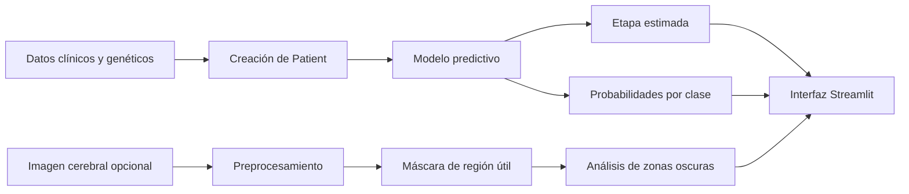

# 🧠 Sistema de detección temprana de Alzheimer

<div align="center">

**Prototipo académico basado en Machine Learning para estimar una etapa orientativa de Alzheimer a partir de variables clínicas, factores genéticos y análisis complementario de imagen cerebral.**


</div>

---

## 📌 Descripción

Este proyecto ha sido desarrollado como **Trabajo Fin de Grado** y explora la aplicación de técnicas de inteligencia artificial en el estudio de la detección temprana del Alzheimer.

La aplicación combina diferentes variables relacionadas con el estado clínico y genético de una persona para generar una **estimación orientativa de la etapa más compatible con el perfil introducido**.

Además, permite adjuntar de forma opcional una imagen cerebral para realizar un análisis visual complementario basado en el porcentaje de zonas oscuras detectadas dentro de la región útil de la imagen.

> [!IMPORTANT]
> La aplicación tiene finalidad exclusivamente académica y experimental. No sustituye una valoración médica, un diagnóstico clínico ni una prueba especializada.

---

## ✨ Funcionalidades principales

- Introducción de variables clínicas mediante una interfaz web.
- Análisis de factores genéticos relacionados con el Alzheimer.
- Clasificación del perfil en una de las etapas contempladas por el modelo.
- Visualización de la probabilidad estimada para cada etapa.
- Identificación clara del resultado principal del modelo.
- Carga opcional de imágenes cerebrales en formato JPG, JPEG o PNG.
- Eliminación del fondo exterior de la imagen.
- Generación de máscaras de preprocesamiento.
- Cálculo de zonas oscuras dentro de la región útil.
- Presentación visual, clara y responsive mediante Streamlit.
- Entrenamiento y carga del modelo con caché para evitar ejecuciones innecesarias.

---

## 🧬 Variables utilizadas

### Variables clínicas

| Variable | Descripción |
|---|---|
| **Edad** | Edad de la persona evaluada. |
| **MMSE** | Puntuación obtenida en el *Mini-Mental State Examination*. |
| **Volumen del hipocampo** | Volumen total aproximado de ambos hemisferios, expresado en mm³. |

### Factores genéticos

| Variable | Descripción |
|---|---|
| **APOE e4** | Número de copias del alelo APOE e4. |
| **APP** | Presencia o ausencia de mutación en el gen APP. |
| **PSEN1** | Presencia o ausencia de mutación en el gen PSEN1. |
| **PSEN2** | Presencia o ausencia de mutación en el gen PSEN2. |

---

## 📊 Etapas contempladas

El modelo distribuye su confianza entre cuatro categorías:

- **Sin indicios de Alzheimer**
- **Etapa inicial**
- **Etapa moderada**
- **Etapa avanzada**

La interfaz muestra la probabilidad relativa asignada a cada una y resalta automáticamente la clase con mayor valor.

> Los porcentajes representan la confianza relativa del modelo entre sus clases. No deben interpretarse como una probabilidad clínica real.

---

## 🖼️ Análisis complementario de imagen

La imagen cerebral es opcional y no modifica la predicción principal generada mediante las variables clínicas y genéticas.

Cuando se adjunta una imagen, el sistema:

1. Valida el formato y carga el archivo.
2. Convierte la imagen para facilitar su procesamiento.
3. Detecta y elimina el fondo negro exterior.
4. Conserva la región útil correspondiente al cerebro.
5. Calcula el porcentaje de zonas oscuras dentro de dicha región.
6. Muestra la imagen original y las máscaras generadas durante el preprocesamiento.

El porcentaje obtenido puede estar relacionado con cavidades, ventrículos, surcos u otros espacios hipodensos visibles, pero **no representa directamente un porcentaje de atrofia ni de Alzheimer**.

---

## 🛠️ Tecnologías utilizadas

- **Python**
- **Streamlit**
- **scikit-learn**
- **Pandas**
- **NumPy**
- **OpenCV**
- **Joblib**
- **HTML y CSS personalizados**

---

## 🏗️ Arquitectura del proyecto

```text
.
├── docs
│    └── uml_class_diagram.md
├── requirements.txt
├── README.md
└── src
    ├── main.py
    ├── app
    │   └── streamlit_app.py
    ├── assets
    │   └── brain_hero.png
    ├── data
    │   ├── alzheimer_data.csv
    │   ├── data_loader.py
    │   └── generate_dataset.py
    ├── domain
    │   └── patient.py
    ├── imaging
    │   ├── brain_image.py
    │   ├── brain_image_processor.py
    │   └── brain_images_analyzer.py
    └── model
        ├── model_trainer.py
        └── predictor.py
```

### Componentes principales

- **`Patient`**: representa el perfil clínico y genético introducido.
- **`DataLoader`**: carga el dataset y separa las variables predictoras de la variable objetivo.
- **`ModelTrainer`**: entrena el modelo de Machine Learning.
- **`Predictor`**: genera la predicción y las probabilidades por clase.
- **`BrainImage`**: valida y carga la imagen cerebral.
- **`BrainImagePreprocessor`**: genera máscaras y elimina el fondo exterior.
- **`BrainImageAnalyzer`**: analiza las zonas oscuras dentro de la región útil.
- **`streamlit_app.py`**: contiene la interfaz web.
- **`main.py`**: coordina la generación de datos, el entrenamiento y la construcción del predictor.

---

## 🚀 Instalación y ejecución

### 1. Clonar el repositorio

```bash
git clone URL_DEL_REPOSITORIO
cd NOMBRE_DEL_REPOSITORIO
```

### 2. Crear un entorno virtual

#### Windows

```powershell
python -m venv .venv
.venv\Scripts\activate
```

#### macOS o Linux

```bash
python3 -m venv .venv
source .venv/bin/activate
```

### 3. Instalar las dependencias

```bash
pip install -r requirements.txt
```

### 4. Ejecutar la aplicación

```bash
streamlit run src/app/streamlit_app.py
```

Después, Streamlit abrirá la interfaz en el navegador. Normalmente estará disponible en:

```text
http://localhost:8501
```

---

## 💻 Uso de la aplicación

1. Introduce la edad, la puntuación MMSE y el volumen del hipocampo.
2. Selecciona los factores genéticos correspondientes.
3. Adjunta una imagen cerebral si deseas obtener el análisis visual complementario.
4. Pulsa **Calcular probabilidad**.
5. Consulta:
   - La etapa estimada.
   - La probabilidad principal.
   - La distribución de probabilidades por etapa.
   - El análisis complementario de la imagen, cuando se haya adjuntado.

---

## 🔄 Flujo general



---

## 🧪 Naturaleza de los datos

El proyecto utiliza un dataset preparado para el desarrollo y la evaluación académica del prototipo.

Por este motivo:

- Los resultados no deben generalizarse directamente a pacientes reales.
- El modelo no ha sido validado como herramienta médica.
- El rendimiento depende de la calidad, variedad y representatividad de los datos empleados.
- Sería necesario trabajar con conjuntos de datos clínicos reales, supervisión especializada y validación externa antes de plantear cualquier uso sanitario.

---

## 🔮 Posibles mejoras futuras

- Entrenamiento con datos clínicos reales y anonimizados.
- Validación del sistema con especialistas.
- Incorporación de nuevas variables y biomarcadores.
- Evaluación y comparación de varios algoritmos de clasificación.
- Integración real de las características extraídas de las imágenes en la predicción principal.
- Aplicación de redes neuronales convolucionales para el análisis de TAC o MRI.
- Explicabilidad del modelo mediante técnicas como SHAP o LIME.
- Gestión segura de usuarios y almacenamiento de historiales.
- Despliegue de la aplicación en un entorno web controlado.

---

## ⚠️ Aviso médico y limitaciones

Este software es un **prototipo académico y experimental**.

Los resultados:

- No constituyen un diagnóstico médico.
- No sustituyen la evaluación de profesionales sanitarios.
- No deben utilizarse para tomar decisiones clínicas.
- No permiten confirmar ni descartar la presencia de Alzheimer.
- No representan una medición clínica directa de atrofia cerebral.

Ante cualquier preocupación relacionada con la memoria, el deterioro cognitivo o la salud neurológica, debe consultarse a un profesional sanitario.

---

## 🎓 Contexto académico

Proyecto desarrollado como parte de un **Trabajo Fin de Grado**, centrado en la aplicación de la informática y el Machine Learning al estudio de la detección temprana del Alzheimer.

El objetivo principal es demostrar el diseño de un sistema completo que incluya:

- Preparación y carga de datos.
- Entrenamiento de un modelo.
- Programación orientada a objetos.
- Predicción de resultados.
- Procesamiento básico de imágenes.
- Desarrollo de una interfaz web.
- Presentación e interpretación responsable de los resultados.

---

## 👩‍💻 Autora

**Miriam Pérez Gómez**

Trabajo Fin de Grado · 2025–2026

---

<div align="center">

Desarrollado con Python, Machine Learning y Streamlit.

**Proyecto académico · Uso experimental · No diagnóstico**

</div>
