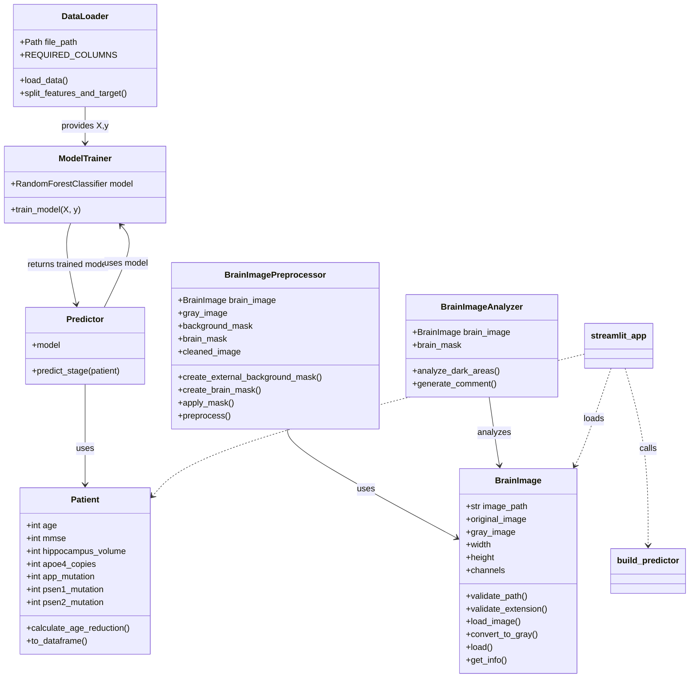

**Diagrama UML de clases**

```mermaid
classDiagram
    class Patient {
        +int age
        +int mmse
        +int hippocampus_volume
        +int apoe4_copies
        +int app_mutation
        +int psen1_mutation
        +int psen2_mutation
        +calculate_age_reduction()
        +to_dataframe()
    }

    class DataLoader {
        +Path file_path
        +REQUIRED_COLUMNS
        +load_data()
        +split_features_and_target()
    }

    class ModelTrainer {
        +RandomForestClassifier model
        +train_model(X, y)
    }

    class Predictor {
        +model
        +predict_stage(patient)
    }

    class BrainImage {
        +str image_path
        +original_image
        +gray_image
        +width
        +height
        +channels
        +validate_path()
        +validate_extension()
        +load_image()
        +convert_to_gray()
        +load()
        +get_info()
    }

    class BrainImagePreprocessor {
        +BrainImage brain_image
        +gray_image
        +background_mask
        +brain_mask
        +cleaned_image
        +create_external_background_mask()
        +create_brain_mask()
        +apply_mask()
        +preprocess()
    }

    class BrainImageAnalyzer {
        +BrainImage brain_image
        +brain_mask
        +analyze_dark_areas()
        +generate_comment()
    }

    DataLoader --> ModelTrainer : provides X,y
    ModelTrainer --> Predictor : returns trained model
    Predictor --> Patient : uses
    Predictor --> ModelTrainer : uses model
    BrainImagePreprocessor --> BrainImage : uses
    BrainImageAnalyzer --> BrainImage : analyzes
    streamlit_app ..> build_predictor : calls
    streamlit_app ..> Patient : creates
    streamlit_app ..> BrainImage : loads

```

Archivo generado automáticamente a partir del código fuente del proyecto.
